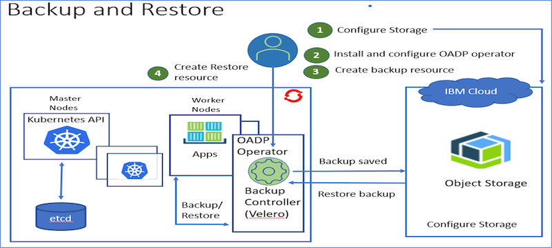
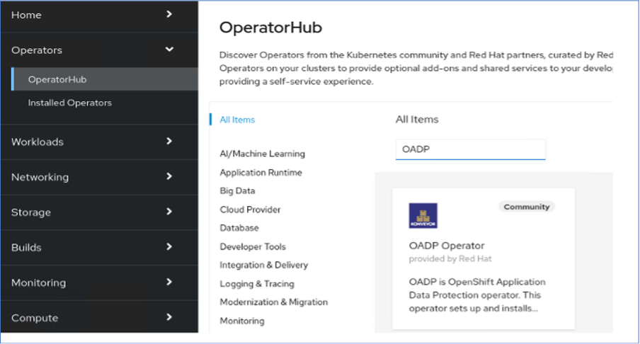
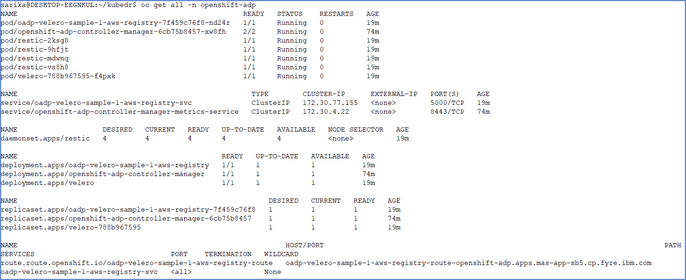
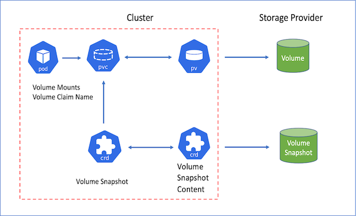
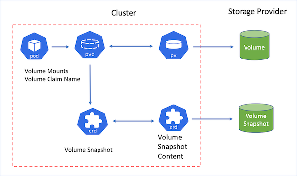

# Backup and Restore

Backup and restore of running containerized applications is a critical task. Without this capability, organizations run the risk of disruption of service and unplanned downtime. This article outlines the architecture, setup, and configure the OADP operator for backup and restoring the Manage application in the OpenShift cluster. OADP is the OpenShift API for the Data Protection operator. This open-source operator sets up and installs [Velero](https://velero.io/) on the OpenShift platform, allowing users to backup and restore applications.

## Architecture
The OADP operator uses a Velero backup controller to backup cluster resources. Velero uses Kubernetes API to create backup and stores the backup files in the configured storage. The data includes Kubernetes resources, such as config maps, secrets, custom resource definitions, custom resources. persistent volumes, persistent volume claims. User can include or exclude resources as needed.





### 1. Configure S3 Storage to store backup files
	- Login to your IBM Cloud account.
    - Create and configure object storage service.

	Multiple storage backends are supported including IBM Cloud Object Storage, Amazon S3, Google Cloud Storage, Azure Blob Storage, and Minio.
	
### 2.Setup OADP operator
    - Log on to the OpenShift web console as the cluster administrator.
    - In the navigation panel, click Operators> OperatorHub.
    - To install the OADP Operator, enter OADP in the search field. Click the OADP Operator card.


	
	
	- Click on the OADP card and install.

#### Create Credentials Secret
    - Create a secret file with the following content. For example,[cloud-cred.yaml](https://github.com/ibm-mas-manage/backup-restore/blob/main/docs/scripts/cloud-cred.yaml)
	

```
[default]
aws_access_key_id=<storage_access_key_id>
aws_secret_access_key=<storage_secret_access_key

```

#### Create secret

```
oc create secret generic cloud-credentials
--namespace openshift-oadp
--from-file cloud - <path-to-secret-file>
```

For example,
```
oc create secret generic cloud-credentials --namespace openshift-adp --from-file cloud=cloud-cred.yaml​
```

#### Create the DataProtectionApplication Custom Resource

- Create an instance for DataProtectionApplication.
	- Add s3Url in config and update bucket in objectStorage section.
    - For example, [dataprotectionapplication-velero-sample.yaml](https://github.com/ibm-mas-manage/backup-restore/blob/main/docs/scripts/dataprotectionapplication-velero-sample.yaml)

```
spec:
  backupLocations:
    - velero:
        config:
          profile: default
          region: us-east-1
          s3ForcePathStyle: 'true'
          s3Url: 'http://s3.us-east.cloud-object-storage.appdomain.cloud'
        credential:
          key: cloud
          name: cloud-credentials
        default: true
        objectStorage:
          bucket: my-bucket-name
          prefix: velero
        provider: aws
  configuration:
    restic:
      enable: true
    velero:
      defaultPlugins:
        - openshift
        - aws
		- csi
  snapshotLocations:
    - velero:
        config:
          profile: default
          region: us-west-2
        provider: aws

```

- After DataProtectionApplication is reconciled, verify **BackupStorageLocations** is created.


### Verify Install
	- Verify all the correct resources have been created, the command `oc get all -n openshift-adp` should look similar to:



## Create Backup
   - In the navigation panel, go to installed Operators. Select OADP and create a Backup instance.
   - Update `includedNamespaces` in the yaml with your Manage namespace/project. For example, [backup-all-manange-sample-1.yaml](https://github.com/ibm-mas-manage/backup-restore/blob/main/docs/scripts/backup-all-manange-sample-1.yaml)
   - Check the backup status.

 


## Backup Details and Troubleshooting
    - Navigate to **Workloads->Pods** in openshift-adp project.
    - Click on Velero pod. Go to Terminal tab. Run the following commands to get backup details

Retrieve backup:
```
./velero  get backups

```

Describe backups:
```
./velero backup describe <backup_name> --details
```
Retrieve backup logs

```
 ./velero backup logs <backup_name>
```

## Create Restore
- In the navigation panel, go to installed Operators. Select OADP and create a Restore instance.
    - Restore needs to be done in two steps. Restore service accounts in step1 and Manage project resources in step 2.
    - Sample [restore-all-manage-sample-1.yaml](https://github.com/ibm-mas-manage/backup-restore/blob/main/docs/scripts/restore-all-manage-sample-1.yaml) and [restore-all-manage-sample-2.yaml](https://github.com/ibm-mas-manage/backup-restore/blob/main/docs/scripts/restore-all-manage-sample-2.yaml)
    - Update `includedNamespaces` in the yaml with your Manage namespace/project and backup name.

### Restore Details and Troubleshooting
    - Navigate to **Workloads->Pods** in openshift-adp project.
    - Click on Velero pod. Go to Terminal tab. Run the following commands to get restore details.

Retrieve restores:
```
./velero get restores
```

Describe restores:
```
./velero restore describe <restore_name>
```


##Schedule Backup

You can specify a schedule to run backups. The duration can be specified using a combination of minutes (m), and hours (h).

Character Position  |  Character Period  | Acceptable Values  | 
------ |----- |-----|
1 | Minute | 0-59,* |
2 | Hour | 0-23,* |
3 | Day of Month | 0-31,* |
4 | Month | 1-12,* |
5 | Day of Week | 1-7,* |

Go to Schedule by navigating to Schedule tab or click on create instance on Schedule card. For example, [schedule-all-manage-sample-1.yaml](https://github.com/ibm-mas-manage/backup-restore/blob/main/docs/scripts/schedule-all-manage-sample-1.yaml)      


## CSI Snapshots
- Manage attached docs can be backed up and restored using CSI plugin.
- Configuration for Attached docs include
	- Storage and Volume Snapshot classes
	- Add label to Volume Snapshot class
		- velero.io/csi-volumesnapshot-class=true
	- Configure PVC/PV using MAS admin UI or add in Manage Workspace CR

Sample Manage Workspace CR snippet:
```
deployment:
      buildTag: latest
      mode: up
      persistentVolumes:
        - mountPath: /doclinks
          pvcName: manage-csi-pvc
          size: 8Gi
          storageClassName: ocs-storagecluster-cephfs
		  
```

- Add attached docs from Manage Application. For example, go to Asset app, attach asset document to Asset record.
- Take a backup 

 


- Restore from backup




## Scenarios`
- Backup should be taken regularly including in the following scenarios:
	- Before deactivating the application
	- Before updating the application
